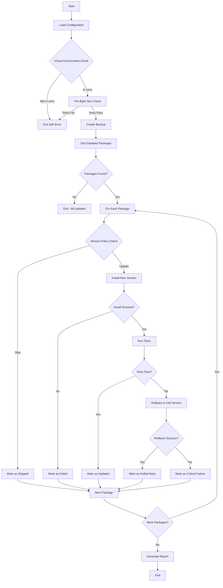

# Covert - Safe Package Updater

[](https://pypi.org/project/covert-updater/)
[](https://pypi.org/project/covert-updater/)
[](https://pypi.org/project/covert-updater/)
[](https://github.com/iodevs-net/covert/actions/workflows/ci.yml)
[](https://codecov.io/gh/iodevs-net/covert)
[](https://covert.readthedocs.io/)

Covert is a safe package updater tool for Python/Django projects that automatically audits and updates dependencies while maintaining system stability through automated testing and rollback mechanisms.

## Features

- **Automatic Outdated Package Detection**: Detects packages that have newer versions available on PyPI
- **Controlled Updates**: Updates packages one-by-one in a sequential manner to isolate issues
- **Automated Testing**: Runs your test suite after each package update to verify system integrity
- **Automatic Rollback**: Automatically rolls back to the previous version if tests fail
- **Backup Creation**: Creates backups before making any changes to enable easy recovery
- **Dry-Run Mode**: Simulate updates without making any actual changes
- **Version Policy Control**: Choose from different version update policies (safe, latest, minor, patch)
- **Virtual Environment Safety**: Requires running in a virtual environment for safety
- **Comprehensive Configuration**: YAML/TOML configuration with sensible defaults

## Installation

### Prerequisites

- Python 3.8 or higher
- pip (latest version recommended)
- A Python project with dependencies to manage

### Install from PyPI (Recommended)

```bash
pip install covert-updater
```

### Install from Source

```bash
# Clone the repository
git clone https://github.com/iodevs-net/covert.git
cd covert

# Install in editable mode
pip install -e .
```

### Install with Development Dependencies

```bash
pip install -e ".[dev]"
```

### Install with Documentation Dependencies

```bash
pip install -e ".[docs]"
```

## Quick Start

### Basic Usage

Run Covert with default settings to update all outdated packages:

```bash
covert
```

### Dry-Run Mode

Simulate updates without making any changes:

```bash
covert --dry-run
```

### With Custom Configuration

```bash
covert -c config.yaml
```

### Ignore Specific Packages

```bash
covert --ignore package1,package2
```

### Skip Tests or Backup

```bash
covert --no-tests    # Skip running tests
covert --no-backup   # Skip creating backup
```

## Configuration

Covert supports configuration via YAML or TOML files. The default configuration file is searched in the following order:

1. `covert.yaml`
2. `covert.toml`
3. `.covert.yml`

### Example Configuration (YAML)

```yaml
# covert.yaml
project:
  name: "My Django Project"
  python_version: "3.11"

testing:
  enabled: true
  command: "pytest"
  args:
    - "-v"
    - "--tb=short"
  exclude_paths:
    - "tests/e2e"
    - "tests/integration"
  timeout_seconds: 300

updates:
  strategy: "sequential"
  max_parallel: 3
  version_policy: "safe"
  ignore_packages:
    - "django"
    - "some-legacy-package"

backup:
  enabled: true
  location: "./backups"
  retention_days: 30
  format: "txt"

logging:
  level: "INFO"
  format: "detailed"
  file: "covert.log"
  console: true

security:
  require_virtualenv: true
  verify_signatures: false
  check_vulnerabilities: true
```

### Example Configuration (TOML)

```toml
# covert.toml
[project]
name = "My Django Project"
python_version = "3.11"

[testing]
enabled = true
command = "pytest"
args = ["-v", "--tb=short"]
exclude_paths = ["tests/e2e", "tests/integration"]
timeout_seconds = 300

[updates]
strategy = "sequential"
max_parallel = 3
version_policy = "safe"
ignore_packages = ["django", "some-legacy-package"]

[backup]
enabled = true
location = "./backups"
retention_days = 30
format = "txt"

[logging]
level = "INFO"
format = "detailed"
file = "covert.log"
console = true

[security]
require_virtualenv = true
verify_signatures = false
check_vulnerabilities = true
```

### Version Policies

| Policy | Description | Example |
|--------|-------------|---------|
| `safe` | Only update if no breaking changes detected | 2.0.0 → 2.1.0 (yes), 2.0.0 → 3.0.0 (no) |
| `latest` | Update to latest available version | 2.0.0 → 3.0.0 (yes) |
| `minor` | Update within minor version | 2.1.0 → 2.2.0 (yes), 2.1.0 → 3.0.0 (no) |
| `patch` | Update within patch version only | 2.1.1 → 2.1.2 (yes), 2.1.1 → 2.2.0 (no) |

## CLI Reference

```
usage: covert [-h] [--config PATH] [--dry-run] [--no-backup] [--no-tests]
              [--parallel] [--ignore PACKAGES] [--verbose] [--version]

Safe package updater for Python/Django projects

options:
  -h, --help            Show this help message and exit

Configuration:
  --config PATH, -c PATH
                        Path to configuration file (YAML or TOML format)
  --ignore PACKAGES     Comma-separated list of packages to ignore during updates

Operation modes:
  --dry-run             Simulate updates without installing any packages
  --no-backup           Skip creating backup before updates
  --no-tests            Skip running tests before and after updates
  --parallel            Enable parallel package updates (experimental)

Output options:
  --verbose, -v         Increase verbosity level (can be used multiple times:
                        -v, -vv)

Information:
  --version             Show version information and exit
```

## Exit Codes

| Code | Meaning |
|------|---------|
| 0 | Success (all updates completed) |
| 1 | General error |
| 3 | Virtual environment not detected |
| 4 | Running with elevated privileges |

## Environment Variables

| Variable | Description | Default |
|----------|-------------|---------|
| `COVERT_CONFIG` | Path to configuration file | `./covert.yaml` |
| `COVERT_LOG_LEVEL` | Logging level | `INFO` |
| `COVERT_NO_COLOR` | Disable colored output | `false` |
| `COVERT_DRY_RUN` | Enable dry-run mode | `false` |

## Architecture

The following diagram shows the Covert update workflow:



## Use Cases

### CI/CD Integration

Integrate Covert into your CI/CD pipeline for automated dependency updates:

```yaml
# .github/workflows/update-dependencies.yml
name: Update Dependencies

on:
  schedule:
    - cron: '0 0 * * 0'  # Weekly on Sunday
  workflow_dispatch:

jobs:
  update:
    runs-on: ubuntu-latest
    steps:
      - uses: actions/checkout@v4
      
      - name: Set up Python
        uses: actions/setup-python@v4
        with:
          python-version: '3.11'
      
      - name: Install Covert
        run: pip install covert-updater
      
      - name: Run Covert
        run: covert --dry-run
      
      - name: Create Pull Request
        if: github.event_name == 'schedule'
        uses: peter-evans/create-pull-request@v5
        with:
          commit-message: 'chore: Update dependencies'
          title: 'Update Dependencies'
          body: Automated dependency updates by Covert
```

### Django Project

Covert is particularly well-suited for Django projects:

```yaml
# django-project.yaml
project:
  name: "My Django Project"
  python_version: "3.11"

testing:
  enabled: true
  command: "pytest"
  args:
    - "--ds=myproject.settings.test"
    - "-v"
  exclude_paths:
    - "tests/e2e"
  timeout_seconds: 600

updates:
  strategy: "sequential"
  version_policy: "safe"
  ignore_packages:
    - "django"  # Handle Django upgrades separately

backup:
  enabled: true
  location: "./backups"
```

## Development

### Setting Up Development Environment

```bash
# Clone the repository
git clone https://github.com/iodevs-net/covert.git
cd covert

# Create a virtual environment
python -m venv venv
source venv/bin/activate  # On Windows: venv\Scripts\activate

# Install development dependencies
pip install -e ".[dev,docs]"

# Run tests
pytest

# Run with coverage
pytest --cov=covert --cov-report=html
```

### Code Quality

The project uses several tools to maintain code quality:

- **Black**: Code formatting
- **isort**: Import sorting
- **Ruff**: Fast linting
- **MyPy**: Type checking

```bash
# Run all linters
black --check covert tests
isort --check-only covert tests
ruff check covert tests
mypy covert
```

## Security

Covert implements several security best practices:

- **No shell=True**: All subprocess calls use `shell=False` to prevent command injection
- **Input Validation**: Package names and versions are validated before use
- **Virtual Environment Check**: Requires running in a virtual environment
- **Privilege Escalation Prevention**: Warns when running as root/administrator
- **Backup Creation**: Always creates backups before making changes

See [SECURITY.md](SECURITY.md) for the full security policy.

## Contributing

Contributions are welcome! Please see [CONTRIBUTING.md](CONTRIBUTING.md) for guidelines on how to contribute to this project.

## License

This project is licensed under the MIT License - see the [LICENSE](LICENSE) file for details.

## Links

- [Documentation](https://covert.readthedocs.io/)
- [GitHub Repository](https://github.com/iodevs-net/covert)
- [Issue Tracker](https://github.com/iodevs-net/covert/issues)
- [PyPI Package](https://pypi.org/project/covert-updater/)
