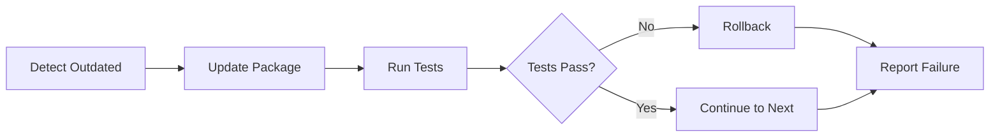

# Covert Documentation

Welcome to the Covert documentation! Covert is a safe package updater tool for Python/Django projects that automatically audits and updates dependencies while maintaining system stability through automated testing and rollback mechanisms.

## What is Covert?

Covert helps you keep your Python dependencies up-to-date safely. Unlike simple `pip install -U`, Covert provides:

- **Automated Testing**: Runs your test suite after each update to verify nothing broke
- **Automatic Rollback**: Reverts to the previous version if tests fail
- **Backup Creation**: Always creates backups before making changes
- **Version Policy Control**: Choose which types of updates to apply (patch, minor, major)
- **Dry-Run Mode**: Preview what would happen without making changes

## Key Features

- 🔒 **Security-First**: Requires virtual environment, validates all inputs
- 🧪 **Test-Driven**: Runs your tests after each package update
- ⏪ **Automatic Rollback**: Reverts changes if tests fail
- 💾 **Backup System**: Creates backups before any changes
- 📋 **Flexible Configuration**: YAML or TOML configuration files
- 🚀 **CLI & Programmatic API**: Use from command line or Python code

## Quick Navigation

```{toctree}
:maxdepth: 2

quickstart
installation
configuration
usage
api
cli
contributing
troubleshooting
```

## Installation

Ready to get started? Head to the [Installation Guide](installation) to install Covert.

## Example Workflow



## Why Use Covert?

| Method | Safety | Automation | Testing | Rollback |
|--------|--------|------------|---------|-----------|
| `pip install -U` | ❌ | ⚠️ | ❌ | ❌ |
| Dependabot | ✅ | ✅ | ❌ | ❌ |
| **Covert** | ✅ | ✅ | ✅ | ✅ |

## Support

- **Documentation**: You're in the right place!
- **Issues**: [GitHub Issues](https://github.com/iodevs-net/covert/issues)
- **Discussions**: [GitHub Discussions](https://github.com/iodevs-net/covert/discussions)

## Indices and Tables

- {ref}`genindex`
- {ref}`modindex`
- {ref}`search`
