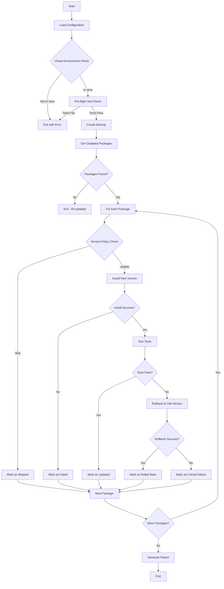
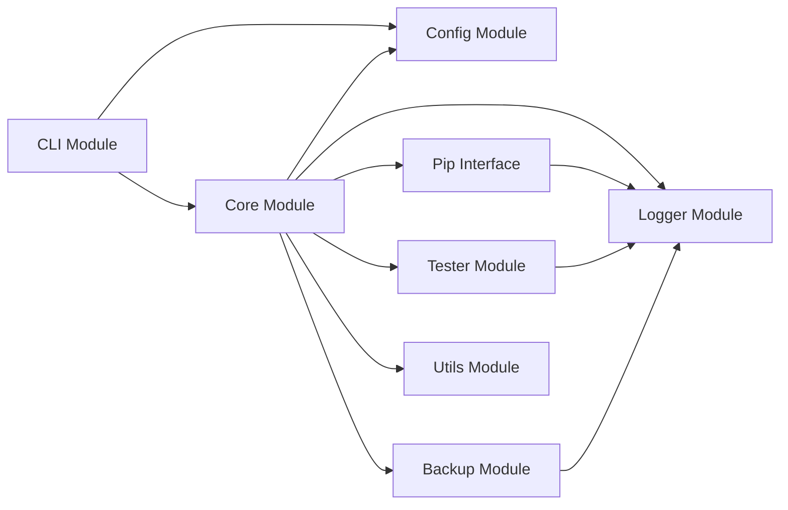

# Covert - Technical Specification & Architecture Plan

## Executive Summary

Covert is a safe package updater tool for Python/Django projects that automatically audits and updates dependencies while maintaining system stability through automated testing and rollback mechanisms. This document outlines the technical specification and architecture for converting the current prototype script into a professional, production-ready Python package.

---

## 1. Project Overview

### 1.1 Purpose
Covert provides automated, safe dependency updates for Python projects with the following core capabilities:
- Detect outdated packages using pip
- Update packages one-by-one in a controlled manner
- Run automated tests after each update to verify system integrity
- Automatically roll back updates if tests fail
- Create backups before making any changes
- Support dry-run mode for simulation without actual changes

### 1.2 Target Users
- Django project maintainers
- Python application developers
- DevOps engineers managing Python deployments
- Security teams auditing dependencies

### 1.3 Current State
- Single Python script (`covert.py`) - 137 lines
- Basic CLI with `--dry-run` and `--ignore` options
- Hard-coded test exclusion paths
- No configuration system
- Spanish language in comments/logs, English in variable names
- Uses `shell=True` in subprocess calls (security concern)

### 1.4 Target State
- Professional Python package installable via pip
- Comprehensive configuration system
- Security-hardened code
- Full test coverage
- Complete documentation
- CI/CD pipeline
- PyPI distribution

---

## 2. Package Architecture

### 2.1 Directory Structure

```
covert/
├── covert/                      # Main package directory
│   ├── __init__.py              # Package initialization, version info
│   ├── cli.py                   # Command-line interface implementation
│   ├── config.py                # Configuration management
│   ├── core.py                  # Core update logic
│   ├── backup.py                # Backup management
│   ├── tester.py                # Test execution and verification
│   ├── pip_interface.py         # Pip command wrapper (secure)
│   ├── logger.py                # Logging infrastructure
│   ├── exceptions.py            # Custom exception classes
│   └── utils.py                 # Utility functions
├── tests/                       # Test suite
│   ├── __init__.py
│   ├── conftest.py              # Pytest fixtures and configuration
│   ├── test_cli.py
│   ├── test_config.py
│   ├── test_core.py
│   ├── test_backup.py
│   ├── test_tester.py
│   ├── test_pip_interface.py
│   └── test_utils.py
├── docs/                        # Documentation
│   ├── source/
│   │   ├── index.md
│   │   ├── installation.md
│   │   ├── configuration.md
│   │   ├── usage.md
│   │   ├── api.md
│   │   └── contributing.md
│   └── static/                  # Static assets (images, etc.)
├── examples/                    # Example configurations and usage
│   ├── config.yaml
│   └── config.toml
├── .github/                     # GitHub-specific files
│   └── workflows/
│       ├── ci.yml               # Continuous Integration
│       ├── publish.yml          # PyPI publishing
│       └── security.yml         # Security scanning
├── pyproject.toml               # Modern Python packaging configuration
├── setup.cfg                    # Additional packaging configuration
├── README.md                    # Main documentation
├── LICENSE                      # MIT License (existing)
├── CHANGELOG.md                 # Version history
├── CONTRIBUTING.md              # Contribution guidelines
├── SECURITY.md                  # Security policy
└── .gitignore                   # Git ignore rules (existing)
```

### 2.2 Module Responsibilities

| Module | Responsibility | Key Functions/Classes |
|--------|---------------|----------------------|
| [`__init__.py`](covert/__init__.py) | Package initialization, version export | `__version__`, public API exports |
| [`cli.py`](covert/cli.py) | Command-line interface | argument parsing, command routing |
| [`config.py`](covert/config.py) | Configuration management | load/save config, validation |
| [`core.py`](covert/core.py) | Main update orchestration | update workflow, state management |
| [`backup.py`](covert/backup.py) | Backup creation/management | create backup, restore from backup |
| [`tester.py`](covert/tester.py) | Test execution | run tests, parse results |
| [`pip_interface.py`](covert/pip_interface.py) | Secure pip wrapper | list outdated, install, uninstall |
| [`logger.py`](covert/logger.py) | Logging infrastructure | setup logging, formatters |
| [`exceptions.py`](covert/exceptions.py) | Custom exceptions | `UpdateError`, `TestError`, etc. |
| [`utils.py`](covert/utils.py) | Utility functions | version parsing, formatting |

---

## 3. Configuration System

### 3.1 Configuration Sources (Priority Order)

1. Command-line arguments (highest priority)
2. Environment variables
3. Configuration file (`covert.yaml`, `covert.toml`, or `.covert.yml`)
4. Default values (lowest priority)

### 3.2 Configuration File Format

#### YAML Format (Recommended)
```yaml
# covert.yaml
project:
  name: "My Django Project"
  python_version: "3.11"

testing:
  enabled: true
  command: "pytest"
  args:
    - "-v"
    - "--tb=short"
  exclude_paths:
    - "tests/e2e"
    - "soporte/tests/e2e"
  timeout_seconds: 300

updates:
  strategy: "sequential"  # sequential, parallel
  max_parallel: 3
  version_policy: "safe"  # safe, latest, minor, patch
  ignore_packages:
    - "package-to-ignore"
    - "another-package"
  allow_only_packages:
    - "allowed-package"

backup:
  enabled: true
  location: "./backups"
  retention_days: 30
  format: "txt"  # txt, json

logging:
  level: "INFO"  # DEBUG, INFO, WARNING, ERROR, CRITICAL
  format: "detailed"  # simple, detailed, json
  file: "covert.log"
  console: true

security:
  require_virtualenv: true
  verify_signatures: false
  check_vulnerabilities: true
```

#### TOML Format (Alternative)
```toml
[project]
name = "My Django Project"
python_version = "3.11"

[testing]
enabled = true
command = "pytest"
args = ["-v", "--tb=short"]
exclude_paths = ["tests/e2e", "soporte/tests/e2e"]
timeout_seconds = 300

[updates]
strategy = "sequential"
max_parallel = 3
version_policy = "safe"
ignore_packages = ["package-to-ignore", "another-package"]

[backup]
enabled = true
location = "./backups"
retention_days = 30
format = "txt"

[logging]
level = "INFO"
format = "detailed"
file = "covert.log"
console = true

[security]
require_virtualenv = true
verify_signatures = false
check_vulnerabilities = true
```

### 3.3 Configuration Schema

```python
from dataclasses import dataclass
from typing import List, Optional

@dataclass
class ProjectConfig:
    name: str
    python_version: str

@dataclass
class TestingConfig:
    enabled: bool
    command: str
    args: List[str]
    exclude_paths: List[str]
    timeout_seconds: int

@dataclass
class UpdatesConfig:
    strategy: str  # "sequential", "parallel"
    max_parallel: int
    version_policy: str  # "safe", "latest", "minor", "patch"
    ignore_packages: List[str]
    allow_only_packages: Optional[List[str]] = None

@dataclass
class BackupConfig:
    enabled: bool
    location: str
    retention_days: int
    format: str  # "txt", "json"

@dataclass
class LoggingConfig:
    level: str
    format: str
    file: str
    console: bool

@dataclass
class SecurityConfig:
    require_virtualenv: bool
    verify_signatures: bool
    check_vulnerabilities: bool

@dataclass
class Config:
    project: ProjectConfig
    testing: TestingConfig
    updates: UpdatesConfig
    backup: BackupConfig
    logging: LoggingConfig
    security: SecurityConfig
```

---

## 4. Core Architecture

### 4.1 Update Workflow



### 4.2 State Management

```python
from enum import Enum
from dataclasses import dataclass
from typing import List, Dict, Optional
from datetime import datetime

class UpdateStatus(Enum):
    """Status codes for package updates."""
    UPDATED = "updated"
    ROLLED_BACK = "rolled_back"
    FAILED_INSTALL = "failed_install"
    CRITICAL_FAILURE = "critical_failure"
    SKIPPED = "skipped"
    PENDING = "pending"

@dataclass
class PackageInfo:
    """Information about a package."""
    name: str
    current_version: str
    latest_version: str
    package_type: str = "regular"

@dataclass
class UpdateResult:
    """Result of a package update attempt."""
    package: PackageInfo
    status: UpdateStatus
    timestamp: datetime
    error_message: Optional[str] = None
    test_output: Optional[str] = None

@dataclass
class UpdateSession:
    """Tracks an entire update session."""
    start_time: datetime
    end_time: Optional[datetime] = None
    backup_file: Optional[str] = None
    results: List[UpdateResult] = None
    pre_test_passed: bool = False
    
    def __post_init__(self):
        if self.results is None:
            self.results = []
    
    @property
    def summary(self) -> Dict[str, int]:
        """Get summary statistics."""
        stats = {status.value: 0 for status in UpdateStatus}
        for result in self.results:
            stats[result.status.value] += 1
        return stats
```

### 4.3 Component Interaction



---

## 5. Security Improvements

### 5.1 Critical Security Fixes

#### 5.1.1 Remove `shell=True`
**Current Issue:**
```python
# insecure.py
result = subprocess.run(command, shell=True, ...)
```

**Solution:**
```python
# secure.py
from typing import List, Union

def run_secure_command(
    command: Union[str, List[str]],
    capture_output: bool = True
) -> subprocess.CompletedProcess:
    """
    Execute command securely without shell=True.
    
    Args:
        command: Command as string (split automatically) or list
        capture_output: Whether to capture stdout/stderr
        
    Returns:
        CompletedProcess with execution results
    """
    if isinstance(command, str):
        # Split command safely
        cmd_list = command.split()
    else:
        cmd_list = command
    
    return subprocess.run(
        cmd_list,
        shell=False,  # Critical: Never use shell=True
        check=False,
        stdout=subprocess.PIPE if capture_output else None,
        stderr=subprocess.PIPE if capture_output else None,
        text=True
    )
```

#### 5.1.2 Input Validation
```python
import re
from typing import Optional

# Valid Python package name regex
PACKAGE_NAME_PATTERN = re.compile(r'^[a-zA-Z0-9]([a-zA-Z0-9._-]*[a-zA-Z0-9])?$')
VERSION_PATTERN = re.compile(r'^[0-9]+(\.[0-9]+)*([a-zA-Z0-9.+-]*)?$')

def validate_package_name(name: str) -> bool:
    """Validate package name follows PEP 508."""
    return bool(PACKAGE_NAME_PATTERN.match(name))

def validate_version(version: str) -> bool:
    """Validate version string format."""
    return bool(VERSION_PATTERN.match(version))

def sanitize_package_name(name: str) -> str:
    """Sanitize package name to prevent injection."""
    if not validate_package_name(name):
        raise ValueError(f"Invalid package name: {name}")
    return name.lower()
```

#### 5.1.3 Virtual Environment Detection
```python
import sys
from pathlib import Path

def is_in_virtualenv() -> bool:
    """Check if running inside a virtual environment."""
    return (
        hasattr(sys, 'real_prefix') or
        (hasattr(sys, 'base_prefix') and sys.base_prefix != sys.prefix)
    )

def get_venv_path() -> Optional[Path]:
    """Get path to current virtual environment."""
    if is_in_virtualenv():
        return Path(sys.prefix)
    return None
```

### 5.2 Additional Security Features

#### 5.2.1 Package Signature Verification (Optional)
```python
import hashlib

def verify_package_integrity(package_name: str, version: str) -> bool:
    """
    Verify package integrity using checksums.
    This is a placeholder - actual implementation would use pip's
    built-in verification or external tools like pip-audit.
    """
    # TODO: Implement actual verification
    return True
```

#### 5.2.2 Vulnerability Scanning Integration
```python
def check_package_vulnerabilities(package_name: str, version: str) -> List[Dict]:
    """
    Check for known vulnerabilities in a package.
    Can integrate with pip-audit, safety, or similar tools.
    """
    # TODO: Integrate with pip-audit or similar
    return []
```

#### 5.2.3 Privilege Escalation Prevention
```python
import os

def check_elevated_privileges() -> bool:
    """Check if running with elevated privileges."""
    try:
        return os.geteuid() == 0  # Unix root check
    except AttributeError:
        # Windows - check if running as administrator
        try:
            import ctypes
            return ctypes.windll.shell32.IsUserAnAdmin() != 0
        except:
            return False
```

---

## 6. Testing Strategy

### 6.1 Test Coverage Goals
- **Unit Tests**: >90% code coverage
- **Integration Tests**: Core workflows
- **End-to-End Tests**: Complete update scenarios
- **Security Tests**: Input validation, command injection prevention

### 6.2 Test Structure

```
tests/
├── unit/
│   ├── test_config.py
│   ├── test_utils.py
│   ├── test_exceptions.py
│   └── test_logger.py
├── integration/
│   ├── test_pip_interface.py
│   ├── test_backup.py
│   └── test_tester.py
├── e2e/
│   ├── test_update_workflow.py
│   └── test_rollback_scenario.py
└── fixtures/
    ├── test_packages/
    └── sample_configs/
```

### 6.3 Key Test Scenarios

| Category | Test Scenario | Expected Outcome |
|----------|--------------|------------------|
| Unit | Config loading from YAML | Config object created |
| Unit | Config validation with invalid data | ValidationError raised |
| Unit | Package name validation | Valid names pass, invalid fail |
| Unit | Version parsing | Correct version objects |
| Integration | Get outdated packages | List of packages returned |
| Integration | Install package | Package installed successfully |
| Integration | Rollback package | Package restored to previous version |
| E2E | Full update with passing tests | All packages updated |
| E2E | Update with failing tests | Packages rolled back |
| E2E | Dry-run mode | No actual changes made |
| Security | Command injection attempt | Command rejected/sanitized |

### 6.4 Test Fixtures

```python
# tests/conftest.py
import pytest
from pathlib import Path
from tempfile import TemporaryDirectory

@pytest.fixture
def temp_dir():
    """Temporary directory for tests."""
    with TemporaryDirectory() as tmpdir:
        yield Path(tmpdir)

@pytest.fixture
def sample_config(temp_dir):
    """Sample configuration file."""
    config_path = temp_dir / "covert.yaml"
    config_path.write_text("""
project:
  name: "Test Project"
  python_version: "3.11"
testing:
  enabled: true
  command: "pytest"
  args: []
  exclude_paths: []
  timeout_seconds: 300
updates:
  strategy: "sequential"
  max_parallel: 1
  version_policy: "safe"
  ignore_packages: []
backup:
  enabled: true
  location: "./backups"
  retention_days: 30
  format: "txt"
logging:
  level: "INFO"
  format: "simple"
  file: "covert.log"
  console: true
security:
  require_virtualenv: false
  verify_signatures: false
  check_vulnerabilities: false
""")
    return config_path

@pytest.fixture
def mock_pip_output():
    """Mock pip list --outdated output."""
    return [
        {
            "name": "requests",
            "version": "2.25.0",
            "latest_version": "2.31.0",
            "latest_filetype": "wheel",
            "package_type": "regular"
        },
        {
            "name": "django",
            "version": "4.2.0",
            "latest_version": "5.0.0",
            "latest_filetype": "wheel",
            "package_type": "regular"
        }
    ]
```

---

## 7. Documentation Structure

### 7.1 Documentation Hierarchy

```
docs/
├── source/
│   ├── index.md              # Landing page
│   ├── quickstart.md         # Quick start guide
│   ├── installation.md       # Installation instructions
│   ├── configuration.md      # Configuration reference
│   ├── usage.md              # Usage examples
│   ├── api.md                # API documentation
│   ├── cli.md                # CLI reference
│   ├── contributing.md       # Contributing guidelines
│   ├── security.md           # Security considerations
│   ├── changelog.md          # Version history
│   └── troubleshooting.md    # Common issues and solutions
└── static/
    ├── images/
    │   ├── workflow.png
    │   └── architecture.png
    └── diagrams/
        └── update-flow.svg
```

### 7.2 Documentation Tools
- **Sphinx** with **MyST** markdown parser
- **sphinx-autodoc** for API documentation
- **sphinx-argparse** for CLI docs
- **GitHub Pages** or **Read the Docs** for hosting

### 7.3 Key Documentation Sections

#### Installation
- Prerequisites
- Installation via pip
- Installation from source
- Verification

#### Configuration
- Configuration file formats
- Environment variables
- Command-line options
- Example configurations

#### Usage
- Basic usage
- Advanced scenarios
- Integration with CI/CD
- Common workflows

#### API Reference
- Module documentation
- Function signatures
- Class documentation
- Type hints

---

## 8. Packaging & Distribution

### 8.1 pyproject.toml

```toml
[build-system]
requires = ["setuptools>=68.0", "wheel"]
build-backend = "setuptools.build_meta"

[project]
name = "covert-up"
version = "0.1.0"
description = "Safe package updater for Python/Django projects"
readme = "README.md"
requires-python = ">=3.8"
license = {text = "MIT"}
authors = [
    {name = "iodevs-net", email = "contact@example.com"}
]
keywords = [
    "dependencies",
    "updates",
    "security",
    "django",
    "testing",
    "rollback"
]
classifiers = [
    "Development Status :: 3 - Alpha",
    "Environment :: Console",
    "Intended Audience :: Developers",
    "License :: OSI Approved :: MIT License",
    "Operating System :: OS Independent",
    "Programming Language :: Python :: 3",
    "Programming Language :: Python :: 3.8",
    "Programming Language :: Python :: 3.9",
    "Programming Language :: Python :: 3.10",
    "Programming Language :: Python :: 3.11",
    "Programming Language :: Python :: 3.12",
    "Topic :: Software Development",
    "Topic :: System :: Software Distribution",
]
dependencies = [
    "pyyaml>=6.0",
    "toml>=0.10.2",
    "rich>=13.0",
    "packaging>=23.0",
]

[project.optional-dependencies]
dev = [
    "pytest>=7.0",
    "pytest-cov>=4.0",
    "pytest-mock>=3.10",
    "black>=23.0",
    "isort>=5.12",
    "mypy>=1.0",
    "ruff>=0.1.0",
]
docs = [
    "sphinx>=7.0",
    "sphinx-rtd-theme>=2.0",
    "myst-parser>=2.0",
]
security = [
    "pip-audit>=2.5",
    "safety>=2.3",
]

[project.scripts]
covert = "covert.cli:main"

[project.urls]
Homepage = "https://github.com/iodevs-net/covert"
Documentation = "https://covert.readthedocs.io"
Repository = "https://github.com/iodevs-net/covert"
Issues = "https://github.com/iodevs-net/covert/issues"

[tool.setuptools]
packages = ["covert"]

[tool.setuptools.package-data]
covert = ["py.typed"]

[tool.black]
line-length = 100
target-version = ["py38", "py39", "py310", "py311", "py312"]

[tool.isort]
profile = "black"
line_length = 100

[tool.mypy]
python_version = "3.8"
warn_return_any = true
warn_unused_configs = true
disallow_untyped_defs = true
disallow_incomplete_defs = true
check_untyped_defs = true
no_implicit_optional = true

[tool.pytest.ini_options]
testpaths = ["tests"]
python_files = ["test_*.py"]
python_classes = ["Test*"]
python_functions = ["test_*"]
addopts = [
    "--strict-markers",
    "--strict-config",
    "--cov=covert",
    "--cov-report=term-missing",
    "--cov-report=html",
]
markers = [
    "unit: Unit tests",
    "integration: Integration tests",
    "e2e: End-to-end tests",
    "slow: Slow running tests",
]

[tool.ruff]
line-length = 100
target-version = "py38"
select = ["E", "F", "W", "I", "N", "UP", "B", "C4"]
ignore = ["E501"]
```

### 8.2 Entry Points

```python
# covert/cli.py
import argparse
from covert.core import run_update_session
from covert.config import load_config
from covert.logger import setup_logging

def main():
    """Main entry point for CLI."""
    parser = argparse.ArgumentParser(
        description="Safe package updater for Python/Django projects",
        formatter_class=argparse.RawDescriptionHelpFormatter
    )
    
    parser.add_argument(
        "--config",
        "-c",
        help="Path to configuration file",
        default=None
    )
    parser.add_argument(
        "--dry-run",
        action="store_true",
        help="Simulate updates without installing"
    )
    parser.add_argument(
        "--ignore",
        help="Comma-separated list of packages to ignore"
    )
    parser.add_argument(
        "--verbose", "-v",
        action="count",
        default=0,
        help="Increase verbosity (can be used multiple times)"
    )
    parser.add_argument(
        "--no-backup",
        action="store_true",
        help="Skip creating backup"
    )
    parser.add_argument(
        "--no-tests",
        action="store_true",
        help="Skip running tests"
    )
    
    args = parser.parse_args()
    
    # Load configuration
    config = load_config(args.config)
    
    # Setup logging
    setup_logging(config.logging, args.verbose)
    
    # Run update session
    session = run_update_session(config, args)
    
    # Exit with appropriate code
    sys.exit(0 if session.success else 1)

if __name__ == "__main__":
    main()
```

---

## 9. CI/CD Pipeline

### 9.1 GitHub Actions Workflow

```yaml
# .github/workflows/ci.yml
name: CI

on:
  push:
    branches: [main, develop]
  pull_request:
    branches: [main, develop]

jobs:
  test:
    runs-on: ${{ matrix.os }}
    strategy:
      matrix:
        os: [ubuntu-latest, windows-latest, macos-latest]
        python-version: ["3.8", "3.9", "3.10", "3.11", "3.12"]
    
    steps:
      - uses: actions/checkout@v4
      
      - name: Set up Python ${{ matrix.python-version }}
        uses: actions/setup-python@v4
        with:
          python-version: ${{ matrix.python-version }}
      
      - name: Install dependencies
        run: |
          python -m pip install --upgrade pip
          pip install -e ".[dev,security]"
      
      - name: Run linters
        run: |
          black --check covert tests
          isort --check-only covert tests
          ruff check covert tests
          mypy covert
      
      - name: Run tests
        run: |
          pytest --cov=covert --cov-report=xml --cov-report=term
      
      - name: Upload coverage
        uses: codecov/codecov-action@v3
        with:
          file: ./coverage.xml

  security:
    runs-on: ubuntu-latest
    
    steps:
      - uses: actions/checkout@v4
      
      - name: Set up Python
        uses: actions/setup-python@v4
        with:
          python-version: "3.11"
      
      - name: Install dependencies
        run: |
          python -m pip install --upgrade pip
          pip install -e ".[dev,security]"
      
      - name: Run pip-audit
        run: pip-audit
      
      - name: Run safety
        run: safety check

  build:
    runs-on: ubuntu-latest
    needs: [test, security]
    
    steps:
      - uses: actions/checkout@v4
      
      - name: Set up Python
        uses: actions/setup-python@v4
        with:
          python-version: "3.11"
      
      - name: Install build dependencies
        run: |
          python -m pip install --upgrade pip
          pip install build twine
      
      - name: Build package
        run: python -m build
      
      - name: Check package
        run: twine check dist/*
```

### 9.2 Publish Workflow

```yaml
# .github/workflows/publish.yml
name: Publish to PyPI

on:
  push:
    tags:
      - "v*.*.*"

permissions:
  contents: read

jobs:
  pypi:
    runs-on: ubuntu-latest
    
    steps:
      - uses: actions/checkout@v4
      
      - name: Set up Python
        uses: actions/setup-python@v4
        with:
          python-version: "3.11"
      
      - name: Install build dependencies
        run: |
          python -m pip install --upgrade pip
          pip install build twine
      
      - name: Build package
        run: python -m build
      
      - name: Publish to PyPI
        uses: pypa/gh-action-pypi-publish@release/v1
        with:
          password: ${{ secrets.PYPI_API_TOKEN }}
```

---

## 10. Implementation Roadmap

### Phase 1: Foundation (Priority: High)
- [ ] Create package directory structure
- [ ] Set up `pyproject.toml` with basic configuration
- [ ] Implement [`config.py`](covert/config.py) module with YAML/TOML support
- [ ] Implement [`exceptions.py`](covert/exceptions.py) with custom exception classes
- [ ] Implement [`logger.py`](covert/logger.py) with proper logging infrastructure
- [ ] Set up basic test structure with [`conftest.py`](tests/conftest.py)

### Phase 2: Core Functionality (Priority: High)
- [ ] Implement [`pip_interface.py`](covert/pip_interface.py) with secure command execution
- [ ] Implement [`tester.py`](covert/tester.py) with configurable test execution
- [ ] Implement [`backup.py`](covert/backup.py) with backup creation/management
- [ ] Implement [`core.py`](covert/core.py) with main update orchestration
- [ ] Implement [`utils.py`](covert/utils.py) with utility functions
- [ ] Write unit tests for all modules

### Phase 3: CLI & Integration (Priority: High)
- [ ] Implement [`cli.py`](covert/cli.py) with full argument parsing
- [ ] Add entry point configuration
- [ ] Write integration tests for core workflows
- [ ] Add dry-run mode implementation
- [ ] Add parallel update support (optional)

### Phase 4: Security Hardening (Priority: High)
- [ ] Remove all `shell=True` usage
- [ ] Implement input validation for package names and versions
- [ ] Add virtual environment detection
- [ ] Add privilege escalation checks
- [ ] Write security-focused tests

### Phase 5: Documentation (Priority: Medium)
- [ ] Set up Sphinx documentation structure
- [ ] Write installation guide
- [ ] Write configuration reference
- [ ] Write usage examples
- [ ] Write API documentation
- [ ] Write contributing guidelines

### Phase 6: Quality & Polish (Priority: Medium)
- [ ] Add type hints throughout codebase
- [ ] Achieve >90% test coverage
- [ ] Set up code quality tools (black, isort, ruff, mypy)
- [ ] Add pre-commit hooks
- [ ] Write end-to-end tests

### Phase 7: CI/CD & Distribution (Priority: Medium)
- [ ] Set up GitHub Actions CI pipeline
- [ ] Add security scanning (pip-audit, safety)
- [ ] Set up automated testing on multiple Python versions
- [ ] Set up PyPI publishing workflow
- [ ] Add CHANGELOG.md maintenance

### Phase 8: Advanced Features (Priority: Low)
- [ ] Add vulnerability scanning integration
- [ ] Add package signature verification
- [ ] Add notification system (Slack, email)
- [ ] Add report generation (JSON, HTML, Markdown)
- [ ] Add interactive mode
- [ ] Add web dashboard (optional)

---

## 11. Language Standardization

### 11.1 Recommendation: Use English Throughout

**Rationale:**
- Wider audience reach
- Consistency with Python ecosystem conventions
- Better international collaboration
- Professional appearance for open-source projects

### 11.2 Migration Plan

| Element | Current | Target | Priority |
|---------|---------|--------|----------|
| Variable names | English | English | No change |
| Function names | English | English | No change |
| Comments | Spanish | English | High |
| Log messages | Spanish | English | High |
| Docstrings | None | English | High |
| CLI help text | Mixed | English | High |
| Configuration keys | English | English | No change |
| README | Spanish | English | High |

---

## 12. Dependencies

### 12.1 Runtime Dependencies
```toml
dependencies = [
    "pyyaml>=6.0",        # YAML configuration support
    "toml>=0.10.2",       # TOML configuration support
    "rich>=13.0",         # Enhanced terminal output
    "packaging>=23.0",    # Version parsing and comparison
]
```

### 12.2 Development Dependencies
```toml
dev = [
    "pytest>=7.0",        # Testing framework
    "pytest-cov>=4.0",    # Coverage reporting
    "pytest-mock>=3.10",  # Mocking support
    "black>=23.0",        # Code formatting
    "isort>=5.12",        # Import sorting
    "mypy>=1.0",          # Type checking
    "ruff>=0.1.0",        # Fast linter
]
```

### 12.3 Documentation Dependencies
```toml
docs = [
    "sphinx>=7.0",        # Documentation generator
    "sphinx-rtd-theme>=2.0",  # Read the Docs theme
    "myst-parser>=2.0",   # Markdown support for Sphinx
]
```

### 12.4 Security Dependencies (Optional)
```toml
security = [
    "pip-audit>=2.5",     # Dependency vulnerability scanner
    "safety>=2.3",        # Security vulnerability checker
]
```

---

## 13. Success Criteria

### 13.1 Technical Criteria
- [ ] Package installable via `pip install covert-up`
- [ ] All security vulnerabilities addressed (no `shell=True`)
- [ ] Test coverage >90%
- [ ] All tests pass on Python 3.8, 3.9, 3.10, 3.11, 3.12
- [ ] Type hints on all public APIs
- [ ] Complete documentation with examples

### 13.2 User Experience Criteria
- [ ] Clear error messages
- [ ] Helpful CLI with `--help` text
- [ ] Sensible defaults with easy configuration
- [ ] Fast execution (minimal overhead)
- [ ] Reliable rollback mechanism

### 13.3 Distribution Criteria
- [ ] Published on PyPI
- [ ] CI/CD pipeline passing
- [ ] Security scanning integrated
- [ ] Version tags following semantic versioning
- [ ] CHANGELOG maintained

---

## 14. Risk Assessment & Mitigation

| Risk | Likelihood | Impact | Mitigation |
|------|-----------|--------|------------|
| Test suite not representative of actual project | Medium | High | Make test configuration highly customizable |
| Rollback fails leaving system in broken state | Low | Critical | Comprehensive error handling, clear recovery instructions |
| Package update breaks compatibility | Medium | Medium | Version policy options (safe, minor, patch) |
| Virtual environment not detected | Low | Medium | Clear error messages, documentation |
| CI/CD pipeline failures | Medium | Low | Thorough testing, staged rollout |
| Security vulnerabilities in dependencies | Medium | High | Regular security scanning, dependency pinning |

---

## 15. Open Questions

1. **Test Command Flexibility**: Should we support arbitrary test commands beyond pytest, or focus on pytest integration?

2. **Parallel Updates**: Is parallel update functionality a priority, or should we focus on sequential updates first?

3. **Notification System**: Should notifications be built-in or left to user's CI/CD pipeline?

4. **Vulnerability Scanning**: Should this be a core feature or an optional integration?

5. **Web Dashboard**: Is a web interface desired, or should we focus on CLI-only?

---

## 16. Appendix

### 16.1 Version Policy Definitions

| Policy | Description | Example |
|--------|-------------|---------|
| `safe` | Only update if no breaking changes detected | 2.0.0 → 2.1.0 (yes), 2.0.0 → 3.0.0 (no) |
| `latest` | Update to latest available version | 2.0.0 → 3.0.0 (yes) |
| `minor` | Update within minor version | 2.1.0 → 2.2.0 (yes), 2.1.0 → 3.0.0 (no) |
| `patch` | Update within patch version only | 2.1.1 → 2.1.2 (yes), 2.1.1 → 2.2.0 (no) |

### 16.2 Exit Codes

| Code | Meaning |
|------|---------|
| 0 | Success (all updates completed) |
| 1 | General error |
| 2 | Pre-flight test failure |
| 3 | Virtual environment not detected |
| 4 | Configuration error |
| 5 | Critical rollback failure |

### 16.3 Environment Variables

| Variable | Description | Default |
|----------|-------------|---------|
| `COVERT_CONFIG` | Path to configuration file | `./covert.yaml` |
| `COVERT_LOG_LEVEL` | Logging level | `INFO` |
| `COVERT_NO_COLOR` | Disable colored output | `false` |
| `COVERT_DRY_RUN` | Enable dry-run mode | `false` |

---

**Document Version:** 1.0  
**Last Updated:** 2025-02-15  
**Status:** Draft - Ready for Review
